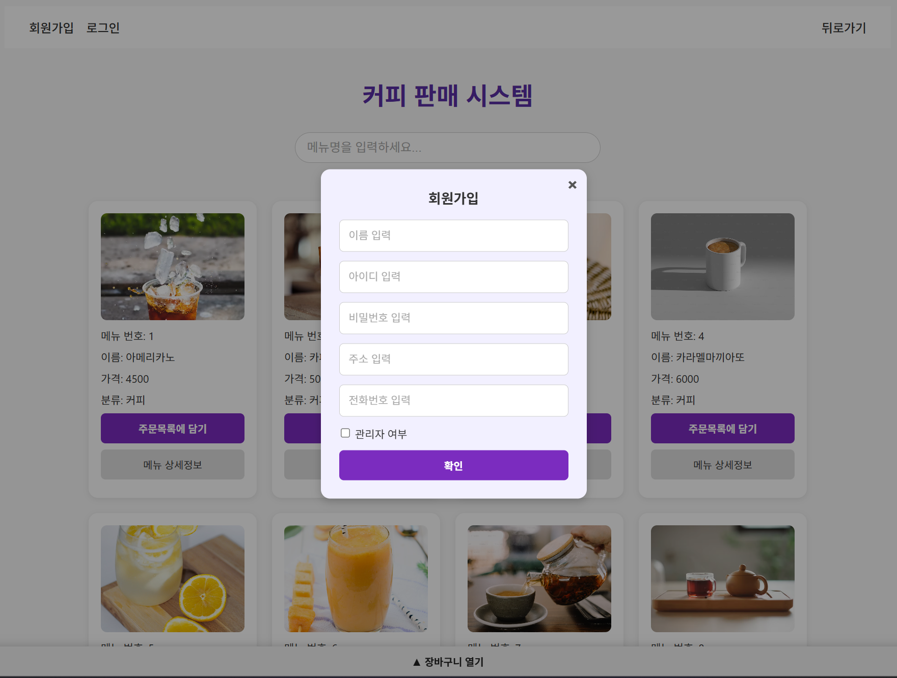

# 커피 판매 시스템

React 기반의 커피 판매 시스템 웹 애플리케이션입니다.  
사용자와 관리자 각각의 역할에 따라 화면과 기능이 분리되어 있습니다.

> 본 프로젝트는 **데이터베이스 설계 과목**의 개인 프로젝트로 제작되었으며,  
> **프론트엔드, 백엔드, MySQL 데이터베이스**까지  
> **모든 구성 요소를 직접 설계하고 구현한 풀스택 웹 애플리케이션입니다.**

---

## 디렉토리 구조

```bash
src/
├── components/
│ ├── popup/ # 팝업 컴포넌트
│ │ ├── auth/ # 로그인, 회원가입
│ │ ├── material/ # 재료 수정
│ │ ├── menu/ # 메뉴 수정, 추가, 레시피
│ │ ├── order/ # 주문 상세
│ │ ├── supplier/ # 공급업체 추가/수정
│ │ └── Popup.jsx # 팝업 타입별 렌더링
│ └── ui/ # 일반 UI 컴포넌트
│ ├── Cart.jsx # 장바구니
│ ├── Header.jsx # 상단 헤더
│ ├── MenuElement.jsx # 메뉴 아이템 UI
│ ├── MenuImage.jsx # 메뉴 이미지 컴포넌트
│ └── SignoutBtn.jsx # 로그아웃 버튼
├── pages/
│ ├── admin/ # 관리자 페이지들
│ ├── customer/ # 사용자 페이지들
│ └── PageNotFound.jsx # 404 페이지
├── recoil/ # 전역 상태 관리
│ ├── OrderListAtom.js # 장바구니 상태
│ ├── PopupAtom.js # 팝업 상태
│ └── UserAuth.js # 사용자 인증 상태
├── styles/
│ └── ButtonLayout.js # 공통 버튼 스타일
├── App.jsx # 라우터 및 레이아웃 설정
├── index.css # 전역 CSS
└── index.jsx # 앱 진입점
```

---

## 기술 스택

### 프론트엔드

- React
- React-Router-Dom
- Recoil
- styled-components
- Axios

### 백엔드

- Express
- Sequelize
- MySQL

---

## API 명세

| Method | Endpoint                     | 설명               |
| ------ | ---------------------------- | ------------------ |
| GET    | `/menus`                     | 전체 메뉴 조회     |
| GET    | `/menus/recipe/:menuItemNum` | 메뉴 레시피 조회   |
| POST   | `/users/order`               | 주문 요청          |
| GET    | `/users/orders`              | 사용자 주문 목록   |
| POST   | `/auth/signin`               | 로그인 요청        |
| POST   | `/auth/signup`               | 회원가입 요청      |
| GET    | `/admin/materials`           | 재료 목록 조회     |
| PUT    | `/admin/materials/:id`       | 재료 수정          |
| POST   | `/admin/menus`               | 메뉴 등록          |
| PUT    | `/admin/menus/:id`           | 메뉴 수정          |
| PATCH  | `/menus/recipe/:id`          | 레시피 사용량 수정 |
| DELETE | `/menus/recipe/:id`          | 레시피 삭제        |
| GET    | `/admin/suppliers`           | 공급업체 목록 조회 |
| POST   | `/admin/suppliers`           | 공급업체 등록      |
| PUT    | `/admin/suppliers/:id`       | 공급업체 수정      |
| POST   | `/admin/suppliers/supply`    | 재료 공급 요청     |

---

## ERD


---

## 클라이언트 화면 및 주요 기능

### 고객 화면

| <br>**홈 화면**<br>전체 메뉴 리스트 조회 및 검색                       | <br>**메뉴 상세**<br>메뉴 가격, 재료, 레시피 확인 및 바로 주문 가능 (레시피에 따른 재료 개수 차감) |
| ------------------------------------------------------------------------------------------------ | ------------------------------------------------------------------------------------------------------------------------------------------ |
| <br>**장바구니**<br>수량 조절, 전체 결제금액 확인, 주문 버튼 | <br>**결제수단 선택**<br>결제수단 선택 후 주문 (레시피에 따른 재료 개수 차감)                  |
| <br>**주문 내역**<br>유저의 주문 목록 전체 조회          | <br>**주문 상세 팝업**<br>주문 내역 상세정보 확인 (재료, 수량 등)                    |
| <br>**로그인**<br>아이디, 비밀번호를 입력하여 로그인               | <br>**회원가입**<br>사용자 정보 입력 후 회원 등록                                                            |

---

### 관리자 화면

| <br>**관리자 홈**<br>메뉴, 재료, 주문 등 관리 메뉴 진입                            | <br>**메뉴 목록**<br>전체 메뉴 조회, 수정 및 레시피 관리 진입     |
| ------------------------------------------------------------------------------------------------------------------------ | ----------------------------------------------------------------------------------------------------------------- |
| <br>**메뉴 추가**<br>메뉴 정보 입력 및 레시피 설정 후 등록 | <br>**메뉴 수정**<br>기존 메뉴의 정보 수정 및 반영  |
| <br>**레시피 관리**<br>메뉴 재료 사용량 수정/삭제          | <br>**재료 목록**<br>전체 재고 및 재료 정보 확인        |
| <br>**재료 수정**<br>이름, 단위, 수량 정보 수정    | <br>**사용자 목록**<br>회원 정보(주소, 이름, 전화번호 등) 확인    |
| <br>**주문 목록**<br>전체 주문 조회 및 상세 진입                       | <br>**주문 상세**<br>재료별 주문 상세 내역 확인   |
| <br>**공급업체 목록**<br>전체 공급업체 정보 조회                 | <br>**공급업체 등록**<br>공급업체 신규 등록 |
| <br>**공급업체 수정**<br>기존 업체 정보 수정       | <br>**재료 공급 요청**<br>납기일, 재료 수량 및 단가 입력 후 요청      |

## 설치 및 실행

```bash
# 1. 프로젝트 클론
git clone https://github.com/sanghyeonLee2/cafe-management-system
cd cafe-management-system

# 2. 의존성 설치
npm i

# 3. 서버 실행
npm run dev

# 4. 클라이언트 실행
npm start
```
